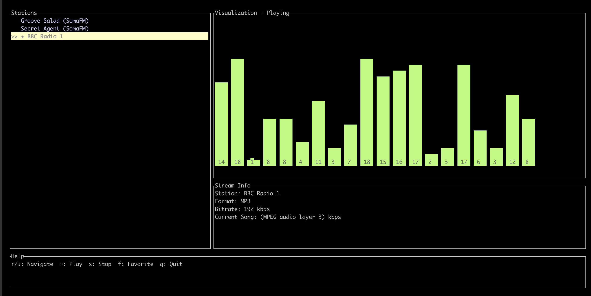

# RadioCLI 📻

[](https://github.com/schlunsen/radiocli/actions/workflows/build.yml)
[](https://opensource.org/licenses/MIT)

A feature-rich terminal-based internet radio player built with Rust and [ratatui](https://github.com/ratatui-org/ratatui).

Developed by [schlunsen](https://github.com/schlunsen)



## Features

- **Beautiful Terminal UI**: Clean, intuitive interface with stations list and audio visualization
- **Audio Visualization**: Real-time visualization of the playing audio stream
- **Stream Metadata**: Display station name, format, bitrate, and current song information
- **Station Management**: Save your favorite stations with star marking
- **SQLite Database**: Persistent storage of your radio stations
- **Keyboard Controls**: Simple and intuitive keyboard navigation

## Requirements

- Rust and Cargo (installation via [rustup](https://rustup.rs/))
- [mpv](https://mpv.io/) media player for audio playback

## Installation

### Using Homebrew (macOS and Linux)

The easiest way to install RadioCLI is with Homebrew:

```bash
brew tap schlunsen/radio-cli https://github.com/schlunsen/radiocli
brew install radio-cli
```

For more details, see the [Homebrew installation guide](./HOMEBREW.md).

### Manual Installation

Clone the repository:

```bash
git clone https://github.com/schlunsen/radiocli.git
cd radiocli
```

Build and run:

```bash
cargo build --release
cargo run --release
```

Or install directly with:

```bash
cargo install --path .
```

## Usage

| Key | Action |
|-----|--------|
| ↑/↓ | Navigate through stations |
| Enter | Play selected station |
| s | Stop playback |
| f | Toggle favorite status |
| q | Quit application |

## Adding Your Own Stations

RadioCLI comes with a few default stations, but you can add your own by modifying the database. The stations are stored in a SQLite database file named `stations.db` in the same directory where you run the application.

You can edit the database using any SQLite client, or by modifying the `init_db` function in the source code to include your favorite stations.

## How It Works

RadioCLI uses:
- **ratatui** for the terminal user interface
- **crossterm** for terminal manipulation
- **rusqlite** for SQLite database management
- **mpv** as the backend for streaming audio
- **rand** for generating audio visualization

The application creates a thread-safe visualization of the audio stream and parses metadata from the station in real-time.

## Custom Development

If you want to modify the code:

1. The main UI is defined in the `ui` function
2. Audio visualization is handled by the `AudioVisualizer` struct
3. Station management is handled in the `init_db` and `load_stations` functions
4. Stream playback and metadata parsing happens in the mpv output thread

## Contributing

Contributions are welcome! Feel free to:

- Open issues for bugs or feature requests
- Submit pull requests for improvements
- Share your feedback

## License

This project is licensed under the MIT License - see the LICENSE file for details.