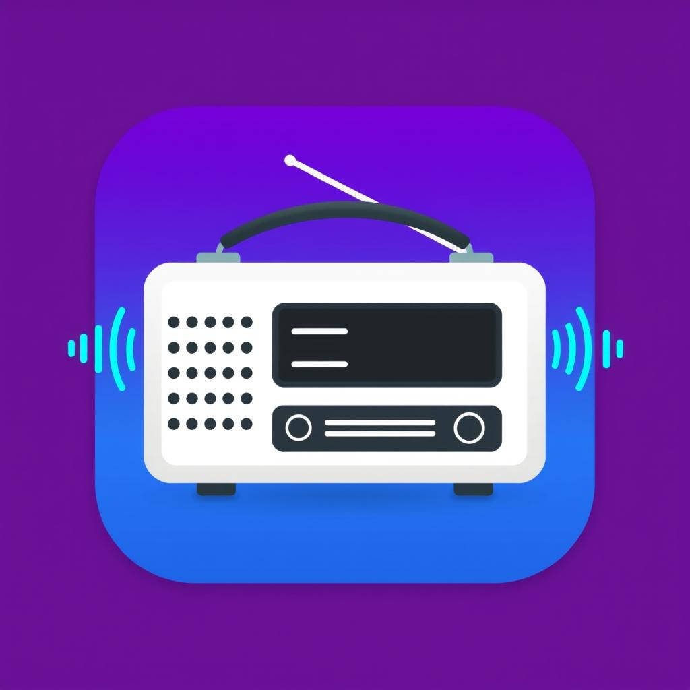

<p align="center">
  
</p>

<h1 align="center">RadioMac</h1>

<p align="center">
  A native macOS menu bar app for streaming internet radio.<br>
  Built with SwiftUI. Shares its station database with <a href="../../">RadioCLI</a>.
</p>

---

## Features

- **Menu bar app** -- lives in your menu bar, no Dock icon clutter
- **Stream radio** -- plays Icecast/MP3 streams via AVPlayer with ICY metadata (current song title)
- **Shared database** -- reads/writes the same `~/.config/radio_cli/stations.db` as the CLI
- **RCast discovery** -- browse and add stations from [rcast.net](https://www.rcast.net)
- **Favorites & stats** -- mark favorites, track listening time per station
- **Now Playing integration** -- shows station/song in macOS Now Playing widget
- **Launch at Login** -- optional via Settings
- **Keyboard media keys** -- play/pause via media remote commands

## Screenshots

| Menu Bar Popover | Station Manager | RCast Discovery |
|:---:|:---:|:---:|
| Popover with now-playing, station list, volume | Full CRUD table with search | Browse & add RCast stations |

## Requirements

- macOS 14.0+ (Sonoma) or later
- Xcode 16+

## Building

```bash
cd mac_app/radio-mac
xcodebuild -scheme radio-mac -configuration Release build
```

Or open `radio-mac.xcodeproj` in Xcode and hit Run.

## Architecture

| File | Purpose |
|------|---------|
| `radio_macApp.swift` | App entry point -- `MenuBarExtra`, manager `Window`, `Settings` |
| `AudioManager.swift` | `@Observable` AVPlayer wrapper with metadata, reconnect, stats tracking |
| `PopoverView.swift` | Menu bar popover UI -- now playing, station list, controls |
| `StationManagerView.swift` | Full window for station CRUD with Table view |
| `RCastView.swift` | RCast station discovery and import |
| `RCastService.swift` | Async HTML parser ported from the Rust CLI |
| `StatsView.swift` | Listening statistics with bar chart |
| `SettingsView.swift` | Preferences -- launch at login, default volume |
| `StationStore.swift` | SQLite database layer (shared with CLI) |
| `Models.swift` | `Station`, `StationStats`, `RcastStation` types |
